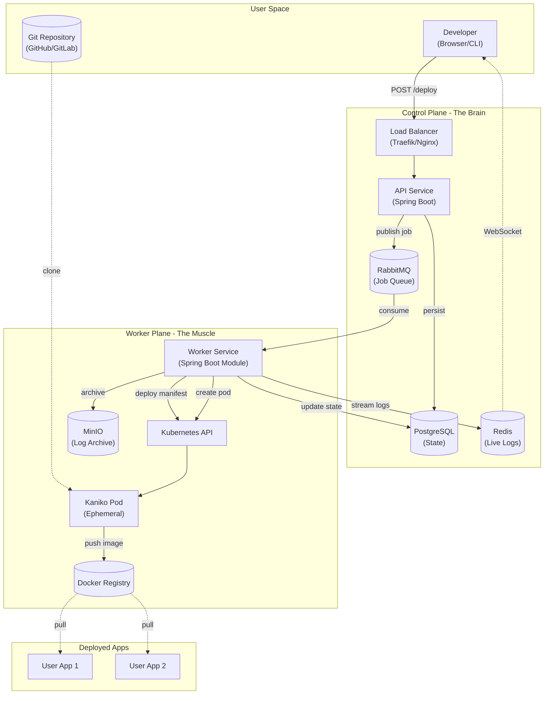

# Ork8stra V2 - Component Diagram

## Visual Architecture

[//]: # (![V3 Architecture]&#40;./v2-architecture.png&#41;)

## Component Descriptions

| Component | Purpose | Technology |
|-----------|---------|------------|
| **Load Balancer** | Traffic routing, SSL termination | Traefik / Nginx Ingress |
| **API Service** | REST API, orchestration | Spring Boot 3 |
| **RabbitMQ** | Async job dispatch | AMQP message broker |
| **PostgreSQL** | Persistent state storage | Relational DB |
| **Redis** | Live log streaming | Pub/Sub + Cache |
| **Worker Service** | Build & deployment execution | Spring Boot module |
| **Kaniko** | Docker image building | Ephemeral K8s Pod |
| **MinIO** | Log archival | S3-compatible storage |
| **Docker Registry** | Image storage | Harbor / DockerHub |
