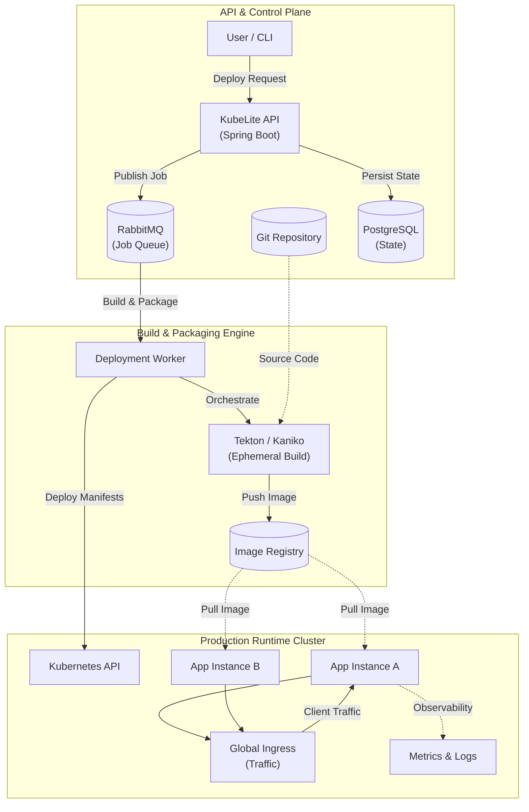

# KubeLite - System Architecture

## Architecture Overview

## Component Descriptions

| Component | Layer | Technology | Functional Description |
| :--- | :--- | :--- | :--- |
| **KubeLite API** | Control Plane | Spring Boot 3 | Central management API for application orchestration. |
| **Deployment Worker** | Build Engine | Spring Modulith | Executes build workflows and manages cluster state. |
| **Tekton / Kaniko** | Build Engine | Tekton / Kaniko | Cloud-native build tools for secure image creation. |
| **Kubernetes API** | Runtime | EKS / GKE / K3s | Container orchestration platform for application hosting. |
| **Global Ingress** | Runtime | Traefik / Nginx | Manages external traffic routing and SSL termination. |
| **PostgreSQL** | Control Plane | PostgreSQL | Persistent storage for platform configurations and state. |
