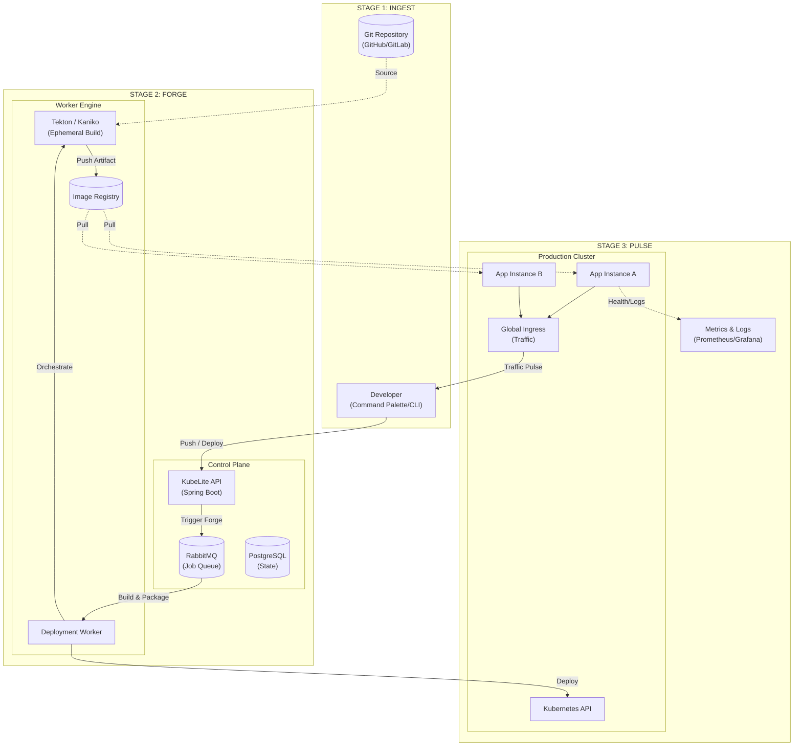

# KubeLite - System Architecture

## Visual Architecture (The Infrastructure Stream)

[//]: # (![V3 Architecture]&#40;./v2-architecture.png&#41;)

## Component Descriptions

| Component | Stage | Technology | Purpose |
| :--- | :--- | :--- | :--- |
| **KubeLite API** | Ingest | Spring Boot 3 | The central brain for orchestration and user interface. |
| **Deployment Worker** | Forge | Spring Modulith | Manages the build lifecycle and Kubernetes state. |
| **Tekton / Kaniko** | Forge | Tekton / Kaniko | Cloud-native image building without Docker-in-Docker. |
| **Kubernetes API** | Pulse | EKS / GKE / K3s | The target runtime for all deployed applications. |
| **Global Ingress** | Pulse | Traefik / Nginx | Handles the traffic pulse and edge routing. |
| **PostgreSQL** | Control | PostgreSQL | Persistent storage for platform and application state. |
