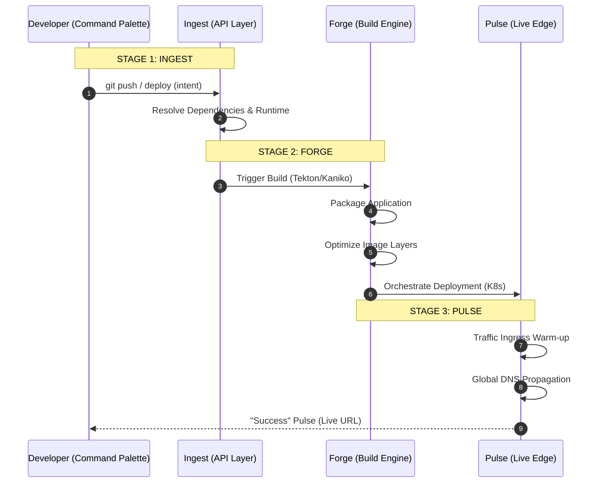

# KubeLite: The Infrastructure Stream Workflow

This diagram visualizes the high-level user journey and the underlying technical synchronization that powers the "Click. Deploy. Done." experience.

## Interaction Design
1.  **Ingest**: Focused on low-friction entry via the Command Palette.
2.  **Forge**: Completely automated, high-density build process.
3.  **Pulse**: Continuous health monitoring and traffic routing.
