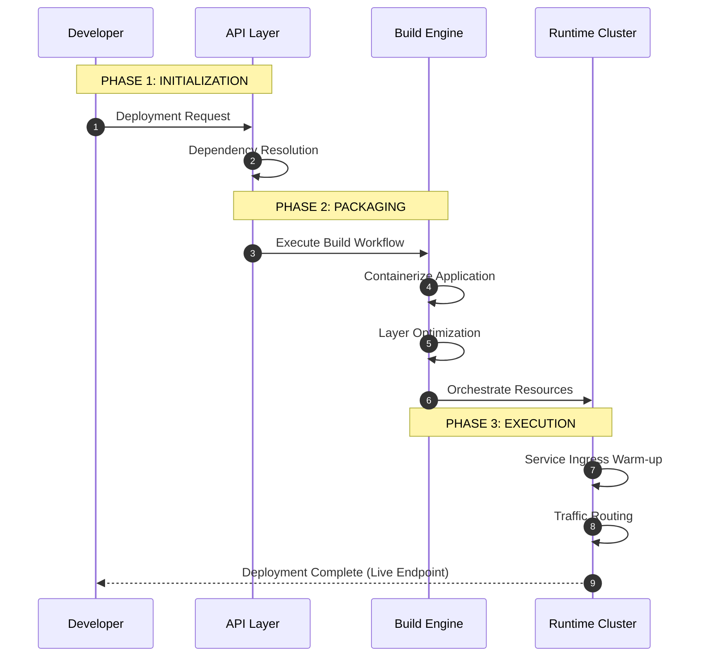

# KubeLite: Deployment Workflow

This diagram visualizes the technical synchronization between core platform layers during the application lifecycle.

## Functional Architecture
1.  **API Layer**: Manages authentication, orchestration intent, and state management.
2.  **Build Engine**: Executes isolated, ephemeral build environments for secure packaging.
3.  **Runtime Cluster**: Provides high-availability hosting and traffic management at the edge.
